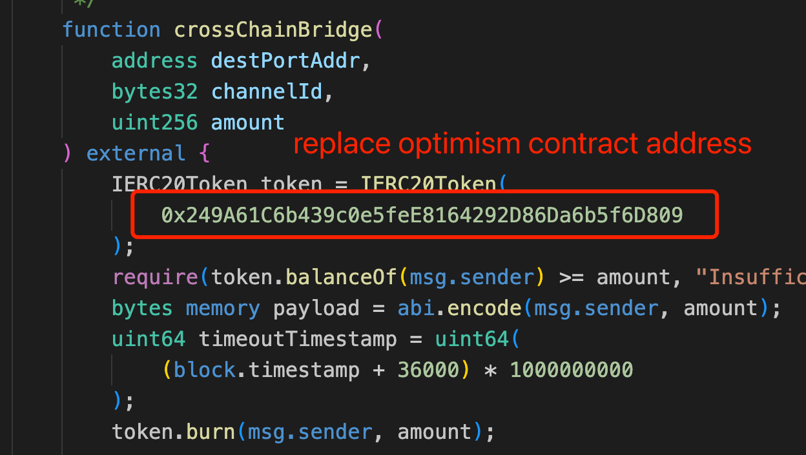
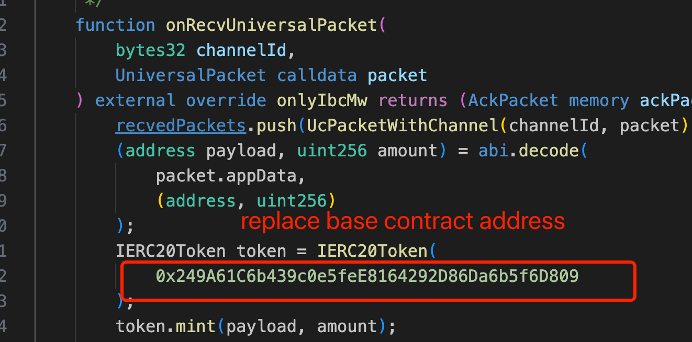
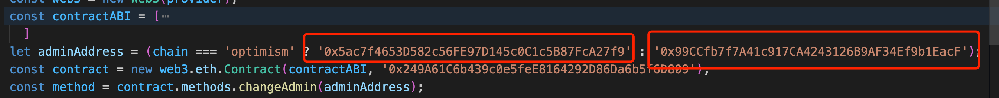

# PIT Phase 1 repo project: BTC token bridge

This repository is created to enter the PIT phase 1 challenge # 3

## Team Members

- @caoshanhuyi - Lead Developer


## Description
This application aims to provide users with a cross-chain bridge for BTC across the entire Ethereum ecosystem, allowing a BTC to freely shuttle among all chains.
Features:

- Uses Polymer x IBC as the cross-chain format
- Committed to a cross-chain bridge for ERC20 tokens, after initiating a transfer on the source chain, the destination chain will mint new tokens, while the corresponding amount of tokens will be burned on the source chain.


## Resources used

The repo uses the [demo-apps](https://github.com/polymerdao/demo-dapps) as starting point and adds custom contracts BTCBridge that implement the custom logic.

Run `just --list` for a full overview of the just commands.

Additional resources used:
- Hardhat
- Blockscout
- React.js
- bignumber.js
- web3.js


After cloning the repo, install dependencies:


## Steps to reproduce


1. After cloning the repo, install BTC token contract dependencies, add your mnemonic to BTC-token-contract/hardhat.config.js 
```
cd BTC-token-contract
npm install
npx hardhat compile
npx hardhat run deploy.js --network optimism
npx hardhat run deploy.js --network base
```
Then you will get ERC20 token contract address on Optimism and Base(current[Optimism: 0x249A61C6b439c0e5feE8164292D86Da6b5f6D809] 
 [base: 0x249A61C6b439c0e5feE8164292D86Da6b5f6D809]), go to `/contracts/BTCBridge.sol` replace these two addresses
 
 

2. Install dependencies of BTC bridge contract:
```sh
just install
```
And add your private key to the .env file (rename it from .env.example).
Check if the contracts compile and deploy your bridge contract:
```sh
just compile
just deploy optimism base
```
Then you will get two contract address on Optimism and Base as portAddress:
    Optimism: 0x5ac7f4653D582c56FE97D145c0C1c5B87FcA27f9
    Base: 0x99CCfb7f7A41c917CA4243126B9AF34Ef9b1EacF
Copy ABI from `/artifacts/contracts/BTCBridge.sol/BTCBridge.json`

3. Set the bridge as the administrator of the token.
Go to BTC-token-contract/auth.js, and replace these two address(from previous step), replace `contractABI` with ABI(from previous step)


```shell
cd BTC-token-contract
node auth.js optimism
node auth.js base
```
4. start frontend page
```
cd BTC-bridge-frontend
npm install
npm run start
```
Open http://localhost:3000/

5. import wallet by using mnemonic or private key
6. add erc20 token to metamask
    op: 0x249A61C6b439c0e5feE8164292D86Da6b5f6D809 (from step 1)
    base: 0x249A61C6b439c0e5feE8164292D86Da6b5f6D809 (from step 1)


## Proof of testnet interaction

After following the steps above you should have interacted with the testnet. You can check this at the [IBC Explorer](https://explorer.ethdenver.testnet.polymer.zone/).

Here's the data of our application:

- BTCBridge (OP Sepolia) : 0x5ac7f4653D582c56FE97D145c0C1c5B87FcA27f9
- BTCBridge (Base Sepolia): 0x99CCfb7f7A41c917CA4243126B9AF34Ef9b1EacF
- Channel (OP Sepolia): channel-10
- Channel (Base Sepolia): channel-11

- Proof of Testnet interaction:
    - [SendTx](https://optimism-sepolia.blockscout.com/tx/0x3bed9aa3d6775433e8d4350650b78ed3d745d12e0d9798905d911521cc58359c)
    - [RecvTx](https://base-sepolia.blockscout.com/tx/0x0d1926f2990d8732cc90c49fc1e69ee3be68d92438d493dc17c9b5d44c87bf40)


## Challenges Faced
Due to the involvement of two chains in the entire interaction process, it is not possible to conduct all debugging in Hardhat, which poses a challenge for debugging.
### What We Learned
Using IBC is a good idea for Ethereum ecosystem
### Future Improvements
In the future, I hope that the official can deploy Relayers in all chains of the Ethereum ecosystem
- Support more chains
- Improve UI
- Add event listeners to alert frontend users.
- Support more ERC20 tokens

 
### Licence
[Apache 2.0](LICENSE)

