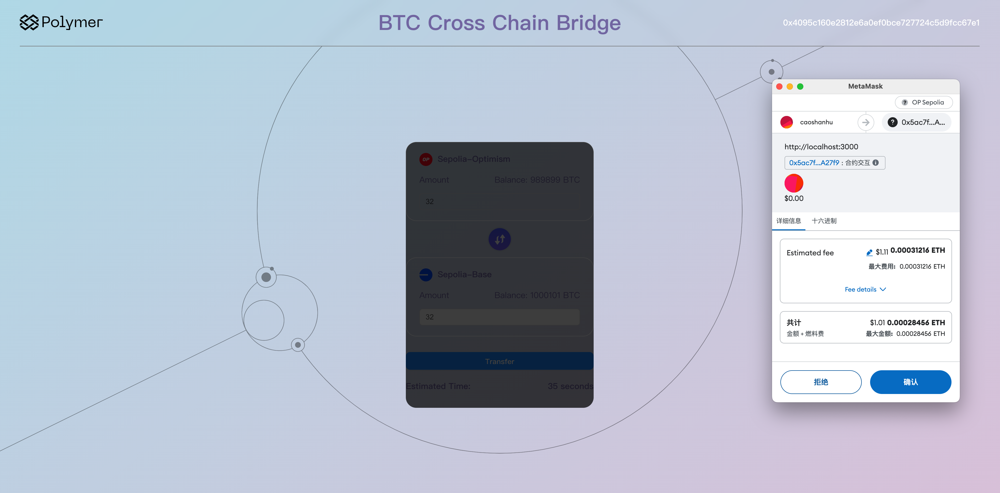

### Project title
BTC token bridge

### Team members
- @caoshanhuyi

### Project Overview
BTC token bridge between Sepolia-Optimism and Sepolia-Base

### Run-book

1. clone projects
```
    git clone https://github.com/caoshanhuyi/BTC-bridge-contract.git
    git clone https://github.com/caoshanhuyi/BTC-token-contract.git
    git clone https://github.com/caoshanhuyi/BTC-bridge-frontend.git
```
2. deplay BTC token contract
```
cd BTC-token-contract
npm install
npx hardhat compile
npx hardhat run deploy.js --network optimism
npx hardhat run deploy.js --network base
```
Then you will get contract address on Optimism and Base(current[Optimism: 0x249A61C6b439c0e5feE8164292D86Da6b5f6D809] 
 [base: 0x249A61C6b439c0e5feE8164292D86Da6b5f6D809]), go to `BTC-bridge-contract/contracts/BTCBridge.sol` replace these two addresses
 
 

3. deploy BTC bridge contract
```shell
cd BTC-bridge-contract
just install
npx hardhat compile
just deploy optimism base
```
Then you will get two contract address on Optimism and Base as portAddress:
    Optimism: 0x5ac7f4653D582c56FE97D145c0C1c5B87FcA27f9
    Base: 0x99CCfb7f7A41c917CA4243126B9AF34Ef9b1EacF
Copy ABI from BTC-bridge-contract/artifacts/contracts/BTCBridge.sol/BTCBridge.json
4. Auth for bridge
Go to BTC-token-contract/auth.js, and replace these two address(from last step), replace `contractABI` with ABI(from last step)

then
```shell
cd BTC-token-contract
node auth.js optimism
node auth.js base
```
5. start frontend page
```
cd BTC-bridge-frontend
npm i && npm run start
```
Open http://localhost:3000/
6. import wallet by using mnemonic
```
subway tray panda three indoor eyebrow grit sunset cannon trophy slush wealth
```
7. add erc20 token to metamask
    op: 0x249A61C6b439c0e5feE8164292D86Da6b5f6D809
    base: 0x249A61C6b439c0e5feE8164292D86Da6b5f6D809

### Resources Used
- hardhat
- @openzeppelin
- vibc-core-smart-contracts
- React
- bignumber.js
- web3.js
### Challenges Faced
The current steps are too cumbersome, and I don't know how to merge two smart contracts together.
### What We Learned
Using IBC is a good idea for Ethereum ecosystem
### Future Improvements
In the future, I hope that the official can deploy Relayers in all chains of the Ethereum ecosystem so that I can deploy contracts in all chains, allowing a BTC to move across every chain in the Ethereum ecosystem.

### Proof
Optimism tx hash: https://optimism-sepolia.blockscout.com/tx/0x7991fb9c21a782cf8bdd1144a38dd2d7d4e8fd55632537d2ced8bd52b6ced16b?tab=index
Base tx hash: https://base-sepolia.blockscout.com/tx/0xf3ca2c904dcc657cf77ded8c2766c5eaa4dcec568d0c44f4c392024eb89777a7?tab=index



### PortAddress
Op: 0x5ac7f4653D582c56FE97D145c0C1c5B87FcA27f9
Base: 0x99CCfb7f7A41c917CA4243126B9AF34Ef9b1EacF
 
### Licence
[Apache 2.0](LICENSE)

